# StayRelay UI/UX-first 100-task progress

Updated: 2026-10-10

The graph records only brief tasks with repository evidence. `Blocked` means the task cannot meet its acceptance criteria without an unavailable authority or dependency. `Not started` means no completion claim has been made.

```mermaid
flowchart LR
  A[001 Route audit\nDONE] --> B[002 Scope reconciliation\nDONE]
  B --> C[003 Toolchain audit\nDONE]
  C --> D[004 Atomic branch policy\nNEXT]
  D --> E[005 Product-state glossary]
  E --> F[006 Role permissions]
  F --> G[007 Route inventory]
  G --> H[008 Content truth rules]
  H --> I[009 Design tokens]
  I --> J[010 Fonts]
  J --> K[011 Typography states]
  K --> L[012 UI primitives]
  L --> M[013 Form primitives]
  M --> N[014 Navigation]
  N --> O[015 Visual regression]
  O --> P[016–032 Discovery]
  P --> Q[043–057 Auth]
  Q --> R[058–068 Buyer]
  R --> S[069–080 Seller]
  S --> T[081–091 Operations]
  T --> U[092–100 Quality/release]
```

## Status

| Range | Status | Evidence |
| --- | --- | --- |
| 001 | Done | [Route audit](UIUX-BRIEF-TASK-001-ROUTE-AUDIT.md) |
| 002–003 | Done | [Scope and toolchain reconciliation](UIUX-FIRST-100-SCOPE.md) |
| 004–008 | Done | [Product contracts](UIUX-FIRST-100-CONTRACTS.md) |
| 009 | Done | Token layer in `packages/ui/tailwind.config.ts` and `packages/ui/src/styles.css`; typecheck/build pass |
| 010 | Blocked | Approved local Inter Variable and Newsreader Variable WOFF2 assets are not present |
| 011 | Done | [Typography contract](UIUX-FIRST-100-TYPOGRAPHY.md) |
| 012 | Done | Shared primitives in `packages/ui/src/components.tsx` |
| 013 | Done | Form primitives in `packages/ui/src/components.tsx` |
| 014 | Done | Responsive AppShell navigation and safe `/admin/login` landing |
| 015 | Blocked | Browser visual regression tooling/screenshots are not available in this environment |
| 016–018 | Done | Marketplace shell, destination context label, and explicit Find/Sell mode UI; sell submission remains draft-only |
| 019–021 | Partial/blocked | [Discovery readiness](UIUX-FIRST-100-DISCOVERY.md); provider and server radius contract unavailable |
| 022–023 | Done | Existing exact-date/guest controls and destination context banner |
| 024 | Partial | Results states exist; map/sort/pagination remain |
| 025 | Blocked | Verified structured inventory fields unavailable |
| 026–031 | Partial/blocked | Result cards exist; policy filters, maps, PostGIS, property detail, request-stay and save-search persistence remain |
| 032 | Done | Public How It Works, Safety, Support, Privacy and Terms placeholder routes |
| 033–037 | Partial | [Media and map readiness](UIUX-FIRST-100-MEDIA-MAPS.md); source/rights audit remains |
| 038 | Done | Responsive media component with dimensions, alt text and fallback |
| 039 | Blocked | Protected admin/storage authority unavailable |
| 040 | Done | Missing/invalid media fallback behavior |
| 041 | Blocked | Maps key, billing and legal approval unavailable |
| 042 | Partial | Provider feature remains disabled pending server location contract |
| 043 | Blocked | Identity project and approved redirects unavailable |
| 044–048 | Done/disabled UI | [Authentication readiness](UIUX-FIRST-100-AUTH.md) |
| 049–050 | Blocked | Server identity/session authority unavailable |
| 051–053 | Partial | Workspace/profile/security contracts without persistence |
| 054–056 | Blocked | Protected role, audit and integration-test authority unavailable |
| 057 | Partial | Markup verified; browser/screen-reader review remains |
| 058–100 | Not started | No completion claim |

The next bounded implementation is TASK-009: accessible design tokens. The canonical governance branch currently carries the audit commits; feature work must use atomic UI/UX branches and remain reviewable.
